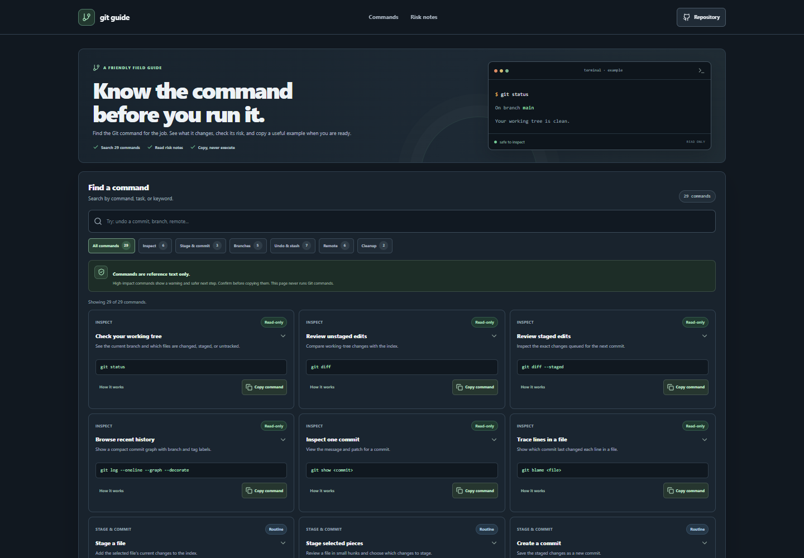

# Git Command Explorer

A browser-based reference for finding common Git commands, understanding their effects and risk, and copying practical examples.

## Local setup

```sh
npm install
npm run dev
```

The complete command guide and deployment details will be added with the finished app.
